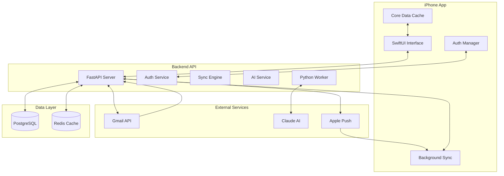
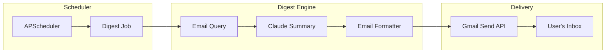

# InboxIQ Technical Architecture

## Executive Summary

InboxIQ is an enterprise-grade iPhone email organizer that uses AI to automatically categorize and manage Gmail emails. This document outlines the complete technical architecture for transforming your MVP into a production-ready iOS application.

**Key Principles:**
- **Native iOS Experience**: Swift/SwiftUI for optimal performance
- **Scalable Backend**: FastAPI for modern async Python capabilities
- **Intelligent Processing**: Claude AI for sophisticated categorization
- **Privacy-First**: Minimal data retention, secure token handling
- **Cost-Effective**: $200-300/month infrastructure budget
- **Pragmatic Simplicity**: Focus on core functionality, defer complexity

## 1. System Architecture

### High-Level Component Overview



### Data Flow Architecture (Simplified for v1)

```
┌─────────────────────────────────────────────────────────────┐
│ User Opens App                                               │
├─────────────────────────────────────────────────────────────┤
│ 1. Check Local Cache (Core Data)                            │
│    └─ Display cached emails immediately                     │
│                                                              │
│ 2. Authenticate with Backend                                 │
│    ├─ Stored tokens? → Refresh                              │
│    └─ No tokens? → OAuth flow                               │
│                                                              │
│ 3. Pull-to-Refresh Sync                                      │
│    ├─ User initiated or background fetch                    │
│    ├─ Delta sync (only changes since last sync)             │
│    └─ Include local sync token                              │
│                                                              │
│ 4. Backend Processing                                        │
│    ├─ Fetch new emails from Gmail                           │
│    ├─ Queue for AI categorization                           │
│    └─ Return immediate response with new emails             │
│                                                              │
│ 5. Background AI Processing                                  │
│    ├─ Python worker polls queue                             │
│    ├─ Categories assigned asynchronously                     │
│    └─ Silent push triggers app refresh                      │
│                                                              │
│ 6. Silent Push Notifications                                 │
│    └─ Trigger background sync for updates                   │
└─────────────────────────────────────────────────────────────┘
```

### Authentication & Session Management

**Why This Approach:**
- JWT for stateless API authentication (scalable)
- OAuth 2.0 for Gmail access (industry standard)
- Refresh token rotation for security

```
┌──────────┐     ┌──────────┐     ┌──────────┐
│  iPhone  │────▶│  Backend │────▶│  Gmail   │
│   App    │◀────│   API    │◀────│   OAuth  │
└──────────┘     └──────────┘     └──────────┘
     │                 │                 │
     │  1. Login      │  2. OAuth      │
     │─────────────▶  │─────────────▶  │
     │                │                 │
     │  6. JWT+       │  3. Auth Code  │
     │◀─────────────  │◀─────────────  │
     │  Refresh       │                 │
     │                │  4. Exchange    │
     │                │─────────────▶  │
     │                │                 │
     │                │  5. Tokens     │
     │                │◀─────────────  │
```

## 2. Technology Stack Decisions

### iOS Application

**Swift/SwiftUI** (Native)
- **Why**: Best performance, latest iOS features, superior UX
- **Alternative considered**: React Native (rejected for performance)
- **Key libraries**:
  ```swift
  // Core dependencies
  - SwiftUI (UI framework)
  - Combine (reactive programming)
  - Core Data (local persistence)
  - Alamofire (networking)
  - KeychainAccess (secure storage)
  - Sentry (crash reporting & monitoring)
  ```

### Backend API

**FastAPI** (Recommended over Flask)
- **Why FastAPI**:
  - Built-in async support (crucial for AI calls)
  - Automatic OpenAPI documentation
  - Type hints + validation (fewer bugs)
  - 20-30% faster than Flask
  - Modern Python features
  - Background tasks built-in (no need for complex orchestration)
  
**Example comparison**:
```python
# FastAPI (cleaner, async-native, with background tasks)
@app.post("/emails/categorize")
async def categorize_email(
    email: EmailModel,
    background_tasks: BackgroundTasks
):
    # Store email immediately
    email_id = await db.store_email(email)
    
    # Queue categorization in background
    background_tasks.add_task(categorize_with_ai, email_id)
    
    return {"email_id": email_id, "status": "processing"}

# Flask (more boilerplate, sync by default, needs Celery)
@app.route("/emails/categorize", methods=["POST"])
def categorize_email():
    data = request.get_json()
    email = validate_email(data)  # Manual validation
    email_id = db.store_email(email)
    categorize_task.delay(email_id)  # Requires Celery setup
    return jsonify({"email_id": email_id, "status": "processing"})
```

### Database Design

**PostgreSQL** with smart partitioning:
```sql
-- Users table
CREATE TABLE users (
    id UUID PRIMARY KEY DEFAULT gen_random_uuid(),
    email VARCHAR(255) UNIQUE NOT NULL,
    created_at TIMESTAMP DEFAULT CURRENT_TIMESTAMP,
    gmail_refresh_token TEXT, -- Encrypted
    last_sync_token VARCHAR(255),
    push_token TEXT -- For APNs
);

-- Emails table (partitioned by month for performance)
CREATE TABLE emails (
    id UUID PRIMARY KEY DEFAULT gen_random_uuid(),
    user_id UUID REFERENCES users(id),
    gmail_id VARCHAR(255) UNIQUE NOT NULL,
    subject TEXT,
    sender VARCHAR(255),
    received_at TIMESTAMP,
    category_id INTEGER REFERENCES categories(id),
    ai_confidence DECIMAL(3,2),
    created_at TIMESTAMP DEFAULT CURRENT_TIMESTAMP
) PARTITION BY RANGE (received_at);

-- Categories table
CREATE TABLE categories (
    id SERIAL PRIMARY KEY,
    name VARCHAR(100) NOT NULL,
    color VARCHAR(7), -- Hex color
    icon VARCHAR(50),
    user_id UUID REFERENCES users(id),
    is_system BOOLEAN DEFAULT FALSE
);

-- Sync state table
CREATE TABLE sync_state (
    user_id UUID PRIMARY KEY REFERENCES users(id),
    last_history_id BIGINT,
    last_sync_at TIMESTAMP,
    sync_status VARCHAR(20)
);

-- AI processing queue (simplified)
CREATE TABLE ai_queue (
    id UUID PRIMARY KEY DEFAULT gen_random_uuid(),
    email_id UUID REFERENCES emails(id),
    status VARCHAR(20) DEFAULT 'pending',
    attempts INTEGER DEFAULT 0,
    processed_at TIMESTAMP,
    error_message TEXT,
    created_at TIMESTAMP DEFAULT CURRENT_TIMESTAMP
);

-- Create index for worker polling
CREATE INDEX idx_ai_queue_pending ON ai_queue(status, created_at) 
WHERE status = 'pending';

-- Daily digest settings
CREATE TABLE digest_settings (
    user_id UUID PRIMARY KEY REFERENCES users(id),
    enabled BOOLEAN DEFAULT TRUE,
    frequency_hours INTEGER DEFAULT 12, -- Every 12 hours by default
    preferred_time TIME DEFAULT '09:00:00', -- 9 AM user's timezone
    timezone VARCHAR(50) DEFAULT 'America/New_York',
    include_action_items BOOLEAN DEFAULT TRUE,
    include_summaries BOOLEAN DEFAULT TRUE,
    created_at TIMESTAMP DEFAULT CURRENT_TIMESTAMP,
    updated_at TIMESTAMP DEFAULT CURRENT_TIMESTAMP
);

-- Digest history
CREATE TABLE digest_history (
    id UUID PRIMARY KEY DEFAULT gen_random_uuid(),
    user_id UUID REFERENCES users(id),
    period_start TIMESTAMP NOT NULL,
    period_end TIMESTAMP NOT NULL,
    email_count INTEGER NOT NULL,
    categories_summary JSONB,
    action_items JSONB,
    sent_at TIMESTAMP,
    gmail_message_id VARCHAR(255),
    ai_cost DECIMAL(10,4),
    created_at TIMESTAMP DEFAULT CURRENT_TIMESTAMP
);

-- Create indexes for digest queries
CREATE INDEX idx_digest_settings_enabled ON digest_settings(enabled, user_id);
CREATE INDEX idx_digest_history_user_sent ON digest_history(user_id, sent_at DESC);
```

### AI Integration Architecture (Simplified)

**Claude API with Simple Worker**:
```python
# ai_service.py - Smart categorization with context
class EmailCategorizationService:
    def __init__(self):
        self.client = anthropic.Client(api_key=CLAUDE_API_KEY)
        self.categories = self.load_categories()
        self.logger = structlog.get_logger()
    
    async def categorize_email(self, email_content: dict) -> dict:
        start_time = time.time()
        
        # Build context-aware prompt
        prompt = f"""
        Categorize this email into one of these categories:
        {self.format_categories()}
        
        Email:
        From: {email_content['sender']}
        Subject: {email_content['subject']}
        Body: {email_content['body'][:500]}  # Limit tokens
        
        Return JSON: {{"category": "name", "confidence": 0.0-1.0}}
        """
        
        try:
            response = await self.client.messages.create(
                model="claude-3-haiku-20240307",  # Fast, cheap for categorization
                messages=[{"role": "user", "content": prompt}],
                max_tokens=100
            )
            
            result = json.loads(response.content[0].text)
            
            # Log for monitoring
            self.logger.info("email_categorized",
                user_id=email_content['user_id'],
                category=result['category'],
                confidence=result['confidence'],
                processing_time_ms=int((time.time() - start_time) * 1000)
            )
            
            return result
            
        except Exception as e:
            self.logger.error("categorization_failed",
                email_id=email_content['email_id'],
                error=str(e)
            )
            raise
```

**Simple Python Worker** (replaces n8n):
```python
# worker.py - Simple, reliable background processor
import asyncio
import structlog
from datetime import datetime, timedelta

class EmailWorker:
    def __init__(self):
        self.ai_service = EmailCategorizationService()
        self.db = Database()
        self.logger = structlog.get_logger()
        self.running = True
    
    async def process_queue(self):
        """Main worker loop - simple and reliable"""
        while self.running:
            try:
                # Get batch of pending emails (up to 10)
                pending = await self.db.fetch("""
                    SELECT q.id, q.email_id, e.subject, e.sender, e.body
                    FROM ai_queue q
                    JOIN emails e ON q.email_id = e.id
                    WHERE q.status = 'pending'
                    AND q.attempts < 3
                    ORDER BY q.created_at
                    LIMIT 10
                    FOR UPDATE SKIP LOCKED
                """)
                
                if not pending:
                    await asyncio.sleep(5)  # No work, wait 5 seconds
                    continue
                
                # Process each email
                for record in pending:
                    await self.process_single_email(record)
                
            except Exception as e:
                self.logger.error("worker_error", error=str(e))
                await asyncio.sleep(10)  # Back off on error
    
    async def process_single_email(self, record):
        """Process one email with error handling"""
        try:
            # Update status to processing
            await self.db.execute("""
                UPDATE ai_queue 
                SET status = 'processing', attempts = attempts + 1
                WHERE id = $1
            """, record['id'])
            
            # Categorize with AI
            result = await self.ai_service.categorize_email({
                'email_id': record['email_id'],
                'subject': record['subject'],
                'sender': record['sender'],
                'body': record['body']
            })
            
            # Update email with category
            await self.db.execute("""
                UPDATE emails 
                SET category_id = $1, ai_confidence = $2
                WHERE id = $3
            """, result['category_id'], result['confidence'], record['email_id'])
            
            # Mark as complete
            await self.db.execute("""
                UPDATE ai_queue 
                SET status = 'complete', processed_at = NOW()
                WHERE id = $1
            """, record['id'])
            
            # Send silent push notification
            await self.send_silent_push(record['user_id'])
            
        except Exception as e:
            # Mark as failed
            await self.db.execute("""
                UPDATE ai_queue 
                SET status = 'failed', error_message = $1
                WHERE id = $2
            """, str(e), record['id'])
            
            self.logger.error("email_processing_failed",
                email_id=record['email_id'],
                error=str(e)
            )

# Run the worker
if __name__ == "__main__":
    worker = EmailWorker()
    asyncio.run(worker.process_queue())
```

### Infrastructure Stack

**Railway.app** deployment:
```yaml
# railway.toml
[build]
builder = "NIXPACKS"

[deploy]
healthcheckPath = "/health"
restartPolicyType = "ON_FAILURE"
restartPolicyMaxRetries = 3

[variables]
PORT = 8000
ENVIRONMENT = "production"
SENTRY_DSN = "your_sentry_dsn"
```

**Additional services**:
- **Redis**: Session cache, rate limiting
- **PostgreSQL**: Railway's managed instance
- **Worker**: Separate Railway service running `worker.py`
- **Monitoring**: Sentry for errors, structured logs for metrics

## 3. RESTful API Design

### Core Endpoints

```yaml
# Authentication
POST   /auth/login          # Initial OAuth flow
POST   /auth/refresh        # Refresh JWT token
POST   /auth/logout         # Revoke tokens

# Email Operations
GET    /emails              # List emails (paginated)
GET    /emails/{id}         # Get single email
POST   /emails/sync         # Trigger manual sync
PATCH  /emails/{id}         # Update category
DELETE /emails/{id}         # Delete email

# Categories
GET    /categories          # List all categories
POST   /categories          # Create custom category
PATCH  /categories/{id}     # Update category
DELETE /categories/{id}     # Delete category

# Push Notifications
POST   /push/register       # Register device token
DELETE /push/unregister     # Remove device token

# Daily Digest
GET    /digest/settings     # Get user's digest settings
PUT    /digest/settings     # Update digest settings
GET    /digest/history      # Get past digests
POST   /digest/test         # Send test digest immediately
GET    /digest/preview      # Preview next digest

# Webhooks
POST   /webhooks/gmail      # Gmail push notifications
```

### Simplified Sync Implementation

```python
# sync_service.py - Focus on reliability over complexity
class GmailSyncService:
    def __init__(self):
        self.gmail = GmailClient()
        self.db = Database()
        self.logger = structlog.get_logger()
    
    async def sync_user_emails(self, user_id: str) -> dict:
        """Delta sync with proper error handling"""
        start_time = time.time()
        
        try:
            # Get user's sync state
            sync_state = await self.db.fetch_one("""
                SELECT last_history_id, gmail_refresh_token
                FROM sync_state s
                JOIN users u ON s.user_id = u.id
                WHERE u.id = $1
            """, user_id)
            
            # Refresh Gmail credentials
            credentials = await self.gmail.refresh_credentials(
                sync_state['gmail_refresh_token']
            )
            
            # Fetch changes since last sync
            if sync_state['last_history_id']:
                # Delta sync
                changes = await self.gmail.get_history(
                    credentials,
                    start_history_id=sync_state['last_history_id']
                )
                new_emails = self.extract_new_emails(changes)
            else:
                # Initial sync - get last 100 emails
                new_emails = await self.gmail.get_recent_emails(
                    credentials,
                    max_results=100
                )
            
            # Store emails and queue for AI
            email_ids = []
            for email in new_emails:
                email_id = await self.store_email(user_id, email)
                email_ids.append(email_id)
                
                # Queue for categorization
                await self.db.execute("""
                    INSERT INTO ai_queue (email_id, status)
                    VALUES ($1, 'pending')
                """, email_id)
            
            # Update sync state
            await self.db.execute("""
                UPDATE sync_state
                SET last_history_id = $1, last_sync_at = NOW()
                WHERE user_id = $2
            """, changes.get('historyId'), user_id)
            
            # Log sync metrics
            self.logger.info("sync_completed",
                user_id=user_id,
                emails_synced=len(email_ids),
                sync_time_ms=int((time.time() - start_time) * 1000)
            )
            
            return {
                "status": "success",
                "emails_synced": len(email_ids),
                "email_ids": email_ids
            }
            
        except Exception as e:
            self.logger.error("sync_failed",
                user_id=user_id,
                error=str(e)
            )
            raise
```

### Push Notification Integration

```python
# push_service.py - Silent push for background updates
class PushNotificationService:
    def __init__(self):
        self.apns_client = APNsClient(
            key_path="path/to/key.p8",
            key_id=APNS_KEY_ID,
            team_id=APPLE_TEAM_ID,
            bundle_id="com.yourcompany.inboxiq"
        )
    
    async def send_silent_push(self, user_id: str):
        """Send silent push to trigger background sync"""
        # Get user's device token
        token = await self.db.fetch_value("""
            SELECT push_token FROM users WHERE id = $1
        """, user_id)
        
        if not token:
            return
        
        # Silent push payload
        payload = {
            "aps": {
                "content-available": 1  # Silent push
            },
            "sync_trigger": True,
            "timestamp": int(time.time())
        }
        
        await self.apns_client.send_notification(token, payload)
```

## 4. Daily Email Digest Feature

### Overview

The Daily Email Digest is an automated summary feature that runs periodically (user-configurable, default every 12 hours) to provide users with a comprehensive overview of their email activity, including categorized summaries, action items, and important highlights.

### Architecture Components



### Implementation Details

#### 1. Scheduler Setup (APScheduler)

```python
# scheduler.py - Digest scheduling with APScheduler
from apscheduler.schedulers.asyncio import AsyncIOScheduler
from apscheduler.triggers.interval import IntervalTrigger
from apscheduler.triggers.cron import CronTrigger
import structlog

class DigestScheduler:
    def __init__(self):
        self.scheduler = AsyncIOScheduler()
        self.digest_service = DigestService()
        self.logger = structlog.get_logger()
        
    async def start(self):
        """Initialize and start the scheduler"""
        self.scheduler.start()
        
        # Run digest check every hour
        self.scheduler.add_job(
            self.process_due_digests,
            trigger=IntervalTrigger(hours=1),
            id='digest_processor',
            replace_existing=True
        )
        
        self.logger.info("digest_scheduler_started")
    
    async def process_due_digests(self):
        """Check which users need digests sent"""
        try:
            # Get users due for digest
            due_users = await self.get_due_users()
            
            for user in due_users:
                # Process each user in background
                await self.process_user_digest(user['id'])
                
        except Exception as e:
            self.logger.error("digest_processing_failed", error=str(e))
    
    async def get_due_users(self):
        """Find users who haven't received digest within their frequency"""
        return await db.fetch_all("""
            SELECT u.id, u.email, ds.frequency_hours, ds.timezone
            FROM users u
            JOIN digest_settings ds ON u.id = ds.user_id
            LEFT JOIN digest_history dh ON u.id = dh.user_id
            WHERE ds.enabled = TRUE
            AND (
                dh.sent_at IS NULL 
                OR dh.sent_at < NOW() - INTERVAL '%s hours'
            )
            GROUP BY u.id, u.email, ds.frequency_hours, ds.timezone
            HAVING MAX(dh.sent_at) < NOW() - INTERVAL '%s hours'
                OR MAX(dh.sent_at) IS NULL
        """, (ds.frequency_hours, ds.frequency_hours))
    
    async def process_user_digest(self, user_id: str):
        """Generate and send digest for a single user"""
        try:
            # Generate the digest
            digest = await self.digest_service.generate_digest(user_id)
            
            # Send via Gmail
            message_id = await self.digest_service.send_digest(user_id, digest)
            
            # Record in history
            await self.record_digest_sent(user_id, digest, message_id)
            
        except Exception as e:
            self.logger.error("user_digest_failed",
                user_id=user_id,
                error=str(e)
            )
```

#### 2. Digest Generation Service

```python
# digest_service.py - Core digest generation logic
class DigestService:
    def __init__(self):
        self.ai_client = anthropic.Client(api_key=CLAUDE_API_KEY)
        self.gmail_service = GmailService()
        self.logger = structlog.get_logger()
    
    async def generate_digest(self, user_id: str) -> dict:
        """Generate comprehensive email digest"""
        start_time = time.time()
        
        # Get user settings
        settings = await self.get_user_settings(user_id)
        
        # Calculate time period
        period_end = datetime.utcnow()
        period_start = period_end - timedelta(hours=settings['frequency_hours'])
        
        # Query emails for the period
        emails = await self.query_period_emails(user_id, period_start, period_end)
        
        if not emails:
            self.logger.info("no_emails_for_digest", user_id=user_id)
            return None
        
        # Group by category
        categorized = self.group_by_category(emails)
        
        # Generate AI summaries
        ai_summary = await self.generate_ai_summary(emails, categorized)
        
        # Extract action items
        action_items = await self.extract_action_items(emails) if settings['include_action_items'] else []
        
        digest = {
            'user_id': user_id,
            'period_start': period_start,
            'period_end': period_end,
            'email_count': len(emails),
            'categories_summary': categorized,
            'action_items': action_items,
            'highlights': ai_summary.get('highlights', []),
            'processing_time': time.time() - start_time
        }
        
        self.logger.info("digest_generated",
            user_id=user_id,
            email_count=len(emails),
            processing_time_ms=int((time.time() - start_time) * 1000)
        )
        
        return digest
    
    async def query_period_emails(self, user_id: str, start: datetime, end: datetime):
        """Get emails for digest period"""
        return await db.fetch_all("""
            SELECT 
                e.id,
                e.subject,
                e.sender,
                e.received_at,
                e.gmail_id,
                c.name as category_name,
                c.color as category_color,
                c.icon as category_icon
            FROM emails e
            LEFT JOIN categories c ON e.category_id = c.id
            WHERE e.user_id = $1
            AND e.received_at >= $2
            AND e.received_at < $3
            ORDER BY e.received_at DESC
        """, user_id, start, end)
    
    async def generate_ai_summary(self, emails: List[dict], categorized: dict) -> dict:
        """Use Claude to generate intelligent summaries"""
        # Build prompt with email data
        prompt = self.build_summary_prompt(emails, categorized)
        
        try:
            response = await self.ai_client.messages.create(
                model="claude-3-haiku-20240307",
                messages=[{
                    "role": "user",
                    "content": prompt
                }],
                max_tokens=1500
            )
            
            # Parse response
            result = json.loads(response.content[0].text)
            
            # Track cost
            tokens_used = response.usage.total_tokens
            cost = self.calculate_cost(tokens_used)
            
            return {
                **result,
                'ai_cost': cost
            }
            
        except Exception as e:
            self.logger.error("ai_summary_failed", error=str(e))
            # Fallback to basic summary
            return self.generate_fallback_summary(emails, categorized)
    
    def build_summary_prompt(self, emails: List[dict], categorized: dict) -> str:
        """Build the prompt for Claude"""
        return f"""
        Analyze these emails from the past {len(emails)} hours and provide a digest summary.
        
        Email Categories:
        {json.dumps(categorized, indent=2)}
        
        Recent Emails (newest first):
        {self.format_email_list(emails[:50])}  # Limit to 50 most recent
        
        Please provide:
        1. A brief summary for each category (2-3 sentences max)
        2. Key highlights or important emails to note
        3. Any patterns or insights you notice
        
        Return as JSON:
        {{
            "category_summaries": {{
                "Work": "Brief summary...",
                "Personal": "Brief summary...",
                ...
            }},
            "highlights": [
                {{"sender": "...", "subject": "...", "summary": "..."}},
                ...
            ],
            "insights": "Any patterns or notable observations"
        }}
        """
    
    async def extract_action_items(self, emails: List[dict]) -> List[dict]:
        """Extract action items using AI"""
        # Filter emails likely to contain action items
        action_emails = [
            e for e in emails 
            if any(keyword in e['subject'].lower() 
                   for keyword in ['urgent', 'asap', 'deadline', 'due', 'action required', 'response needed'])
        ]
        
        if not action_emails:
            return []
        
        prompt = f"""
        Extract action items from these emails. Look for:
        - Tasks with deadlines
        - Requests requiring response
        - Meeting invitations
        - Important reminders
        
        Emails:
        {self.format_email_list(action_emails[:20])}
        
        Return as JSON array:
        [
            {{
                "priority": "URGENT|HIGH|NORMAL",
                "action": "Brief description",
                "deadline": "date if mentioned or null",
                "from": "sender email",
                "subject": "email subject"
            }}
        ]
        """
        
        try:
            response = await self.ai_client.messages.create(
                model="claude-3-haiku-20240307",
                messages=[{"role": "user", "content": prompt}],
                max_tokens=800
            )
            
            return json.loads(response.content[0].text)
            
        except Exception as e:
            self.logger.error("action_extraction_failed", error=str(e))
            return []
```

#### 3. Email Formatting and Sending

```python
# digest_formatter.py - Format digest as HTML email
class DigestFormatter:
    def format_digest_email(self, digest: dict) -> tuple[str, str]:
        """Format digest as HTML and plain text"""
        # HTML version
        html_content = f"""
        <html>
        <head>
            <style>
                body {{ font-family: -apple-system, Arial, sans-serif; line-height: 1.6; color: #333; }}
                .header {{ background: linear-gradient(135deg, #667eea 0%, #764ba2 100%); color: white; padding: 30px; text-align: center; }}
                .container {{ max-width: 600px; margin: 0 auto; padding: 20px; }}
                .category {{ margin: 20px 0; padding: 15px; background: #f8f9fa; border-radius: 8px; }}
                .category-header {{ display: flex; align-items: center; margin-bottom: 10px; }}
                .category-icon {{ font-size: 24px; margin-right: 10px; }}
                .action-item {{ background: #fff3cd; border-left: 4px solid #ffc107; padding: 10px; margin: 10px 0; }}
                .urgent {{ border-left-color: #dc3545; background: #f8d7da; }}
                .highlight {{ background: white; padding: 15px; margin: 10px 0; border-radius: 5px; box-shadow: 0 2px 4px rgba(0,0,0,0.1); }}
                .footer {{ text-align: center; color: #666; font-size: 12px; margin-top: 30px; }}
            </style>
        </head>
        <body>
            <div class="header">
                <h1>📧 InboxIQ Daily Digest</h1>
                <p>{digest['email_count']} emails categorized in the last {self.get_period_hours(digest)} hours</p>
            </div>
            
            <div class="container">
                {self.format_summary_section(digest)}
                {self.format_action_items_section(digest)}
                {self.format_highlights_section(digest)}
            </div>
            
            <div class="footer">
                <p>Generated by InboxIQ • <a href="{{unsubscribe_url}}">Manage digest settings</a></p>
            </div>
        </body>
        </html>
        """
        
        # Plain text version
        text_content = self.format_plain_text_digest(digest)
        
        return html_content, text_content
    
    def format_summary_section(self, digest: dict) -> str:
        """Format category summaries"""
        html = "<h2>📊 Summary by Category</h2>"
        
        for category, data in digest['categories_summary'].items():
            icon = data.get('icon', '📁')
            count = data.get('count', 0)
            summary = data.get('summary', '')
            
            html += f"""
            <div class="category">
                <div class="category-header">
                    <span class="category-icon">{icon}</span>
                    <strong>{category}</strong>: {count} emails
                </div>
                <p>{summary}</p>
            </div>
            """
        
        return html

# gmail_sender.py - Send digest via Gmail API
class DigestSender:
    def __init__(self):
        self.gmail_service = GmailService()
        self.formatter = DigestFormatter()
    
    async def send_digest(self, user_id: str, digest: dict) -> str:
        """Send formatted digest email via Gmail API"""
        # Get user's email and credentials
        user = await db.fetch_one("""
            SELECT email, gmail_refresh_token 
            FROM users 
            WHERE id = $1
        """, user_id)
        
        # Format email content
        html_content, text_content = self.formatter.format_digest_email(digest)
        
        # Create email message
        message = self.create_message(
            to=user['email'],
            subject=f"InboxIQ Daily Digest - {digest['email_count']} emails categorized",
            html_content=html_content,
            text_content=text_content
        )
        
        # Send via Gmail API
        credentials = await self.gmail_service.refresh_credentials(
            user['gmail_refresh_token']
        )
        
        sent_message = await self.gmail_service.send_message(
            credentials,
            message
        )
        
        return sent_message['id']
    
    def create_message(self, to: str, subject: str, html_content: str, text_content: str) -> dict:
        """Create a MIME message"""
        message = MIMEMultipart('alternative')
        message['to'] = to
        message['from'] = f"InboxIQ Digest <{to}>"  # Send from user's own email
        message['subject'] = subject
        
        # Add plain text and HTML parts
        part1 = MIMEText(text_content, 'plain')
        part2 = MIMEText(html_content, 'html')
        
        message.attach(part1)
        message.attach(part2)
        
        # Encode the message
        return {'raw': base64.urlsafe_b64encode(message.as_bytes()).decode()}
```

#### 4. API Endpoints Implementation

```python
# digest_endpoints.py - FastAPI endpoints for digest management
@app.get("/digest/settings")
async def get_digest_settings(
    current_user: User = Depends(get_current_user)
):
    """Get user's digest settings"""
    settings = await db.fetch_one("""
        SELECT 
            enabled,
            frequency_hours,
            preferred_time,
            timezone,
            include_action_items,
            include_summaries
        FROM digest_settings
        WHERE user_id = $1
    """, current_user.id)
    
    if not settings:
        # Return defaults
        return {
            "enabled": True,
            "frequency_hours": 12,
            "preferred_time": "09:00",
            "timezone": "America/New_York",
            "include_action_items": True,
            "include_summaries": True
        }
    
    return dict(settings)

@app.put("/digest/settings")
async def update_digest_settings(
    settings: DigestSettingsModel,
    current_user: User = Depends(get_current_user)
):
    """Update digest settings"""
    await db.execute("""
        INSERT INTO digest_settings (
            user_id, enabled, frequency_hours, preferred_time,
            timezone, include_action_items, include_summaries
        ) VALUES ($1, $2, $3, $4, $5, $6, $7)
        ON CONFLICT (user_id) DO UPDATE SET
            enabled = EXCLUDED.enabled,
            frequency_hours = EXCLUDED.frequency_hours,
            preferred_time = EXCLUDED.preferred_time,
            timezone = EXCLUDED.timezone,
            include_action_items = EXCLUDED.include_action_items,
            include_summaries = EXCLUDED.include_summaries,
            updated_at = CURRENT_TIMESTAMP
    """, current_user.id, settings.enabled, settings.frequency_hours,
        settings.preferred_time, settings.timezone, 
        settings.include_action_items, settings.include_summaries)
    
    return {"status": "success"}

@app.post("/digest/test")
async def send_test_digest(
    current_user: User = Depends(get_current_user),
    background_tasks: BackgroundTasks
):
    """Send a test digest immediately"""
    # Queue digest generation in background
    background_tasks.add_task(
        generate_and_send_digest,
        current_user.id
    )
    
    return {
        "status": "queued",
        "message": "Test digest will be sent to your inbox shortly"
    }

@app.get("/digest/preview")
async def preview_digest(
    current_user: User = Depends(get_current_user)
):
    """Preview what the next digest would contain"""
    digest_service = DigestService()
    digest = await digest_service.generate_digest(current_user.id)
    
    if not digest:
        return {"message": "No emails to digest"}
    
    # Return digest data without sending
    return {
        "email_count": digest['email_count'],
        "period_hours": digest['period_hours'],
        "categories": digest['categories_summary'],
        "action_items": digest['action_items'][:5],  # Limit preview
        "would_send_at": "next scheduled time"
    }
```

### Cost Analysis

**Claude API Costs for Digest Generation:**
- Model: Claude 3 Haiku (cheapest, fastest)
- Input tokens: ~2,000 per digest (email list + prompt)
- Output tokens: ~500 per digest (summaries + action items)
- Cost per digest: ~$0.001
- Monthly cost per user (2 digests/day): ~$0.06
- For 1,000 active users: ~$60/month

**Optimization Strategies:**
1. Cache similar email patterns
2. Batch multiple users' digests in single API calls where possible
3. Skip digest if email count < 5
4. Use rule-based extraction for obvious action items

### Integration with Existing Architecture

The Daily Digest feature integrates seamlessly with the existing InboxIQ architecture:

1. **Uses existing categorization data** - No need to re-categorize
2. **Leverages Gmail OAuth tokens** - Can send on user's behalf
3. **Minimal infrastructure** - Just adds APScheduler to existing worker
4. **Reuses AI service patterns** - Same error handling and monitoring

## 5. Security & Privacy Architecture

### Token Storage

```python
# Secure token handling with monitoring
from cryptography.fernet import Fernet
import structlog

class TokenVault:
    def __init__(self):
        # Key from environment, rotated monthly
        self.cipher = Fernet(os.getenv("ENCRYPTION_KEY").encode())
        self.logger = structlog.get_logger()
    
    def encrypt_token(self, token: str) -> str:
        encrypted = self.cipher.encrypt(token.encode()).decode()
        self.logger.info("token_encrypted", 
            token_length=len(token)
        )
        return encrypted
    
    def decrypt_token(self, encrypted: str) -> str:
        try:
            decrypted = self.cipher.decrypt(encrypted.encode()).decode()
            return decrypted
        except Exception as e:
            self.logger.error("token_decryption_failed", error=str(e))
            raise
```

### API Security Layers

```python
# Rate limiting with Redis
from fastapi_limiter import FastAPILimiter
from fastapi_limiter.depends import RateLimiter
import sentry_sdk

@app.on_event("startup")
async def startup():
    # Initialize Redis for rate limiting
    redis = await aioredis.create_redis_pool("redis://localhost")
    await FastAPILimiter.init(redis)
    
    # Initialize Sentry for error tracking
    sentry_sdk.init(
        dsn=os.getenv("SENTRY_DSN"),
        environment=os.getenv("ENVIRONMENT", "development"),
        traces_sample_rate=0.1
    )

@app.post("/emails/sync", dependencies=[Depends(RateLimiter(times=10, minutes=1))])
async def sync_emails():
    # Max 10 syncs per minute per user
    pass
```

### Data Privacy

**Principles**:
1. **Minimal retention**: Delete email bodies after categorization
2. **No training**: Never use customer data for AI training
3. **Encryption**: AES-256 at rest, TLS 1.3 in transit
4. **Audit logs**: Track all data access

```python
# Privacy-conscious email processing with monitoring
async def process_email_privately(email: dict):
    # Extract only necessary fields
    metadata = {
        "subject": email["subject"],
        "sender": extract_email_domain(email["from"]),
        "timestamp": email["timestamp"],
        "size": len(email.get("body", ""))
    }
    
    # Categorize without storing body
    category = await ai_service.categorize(email["body"])
    
    # Store only metadata + category
    await db.store_email_metadata(metadata, category)
    
    # Log for compliance
    logger.info("email_processed",
        user_id=email["user_id"],
        retained_body=False,
        category_assigned=True
    )
    
    # Don't store email body
    return category
```

## 5. Development Phases & Timeline (Revised for Lower Risk)

### Phase 1: Core Backend + Gmail Sync (Weeks 1-2.5) 🔴 CRITICAL
**Goal**: Rock-solid Gmail sync foundation

**Week 1**:
- [ ] Set up FastAPI project structure
- [ ] Implement JWT authentication
- [ ] Create database schema
- [ ] Set up Sentry + structured logging
- [ ] Basic health check endpoints

**Week 2**:
- [ ] Gmail OAuth 2.0 flow
- [ ] **Gmail sync engine (FULL FOCUS)**
  - [ ] Initial sync (last 100 emails)
  - [ ] Delta sync with history API
  - [ ] Error handling for all edge cases
  - [ ] Comprehensive sync testing
- [ ] Deploy to Railway

**Week 2.5**:
- [ ] Sync edge case testing
- [ ] Performance optimization
- [ ] Monitoring dashboards

**Deliverable**: Backend API with bulletproof Gmail sync

### Phase 2: iPhone App Foundation + Daily Digest (Weeks 3-4.5)
**Goal**: Native app with core functionality and digest feature

**Week 3**:
- [ ] SwiftUI app structure
- [ ] Authentication screens
- [ ] Core Data models
- [ ] API client service
- [ ] Keychain integration
- [ ] Sentry iOS setup

**Week 4**:
- [ ] Email list view
- [ ] Pull-to-refresh
- [ ] Local caching strategy
- [ ] Background fetch setup
- [ ] Silent push handling
- [ ] Basic settings

**Week 4.5 (Additional 2-3 days for Daily Digest)**:
- [ ] APScheduler integration in worker
- [ ] Digest generation service
- [ ] Email formatter (HTML + plain text)
- [ ] Gmail send implementation
- [ ] Digest settings UI in app
- [ ] Test digest functionality

**Deliverable**: Working app with email sync and daily digest feature

### Phase 3: AI Integration (Weeks 5-6)
**Goal**: Smart categorization working end-to-end

**Week 5**:
- [ ] Claude API integration
- [ ] Categorization prompts
- [ ] Simple Python worker setup
- [ ] Queue processing logic
- [ ] Category management UI

**Week 6**:
- [ ] Worker monitoring
- [ ] Retry logic
- [ ] Cost tracking
- [ ] Performance optimization
- [ ] Bulk categorization

**Deliverable**: Emails automatically categorized with AI

### Phase 4: Polish & App Store (Weeks 7-8)
**Goal**: Production-ready app

**Week 7**:
- [ ] UI/UX polish
- [ ] Dark mode
- [ ] Accessibility
- [ ] Performance testing
- [ ] Battery optimization
- [ ] Error handling UI

**Week 8**:
- [ ] App Store assets
- [ ] Privacy policy
- [ ] Terms of service
- [ ] Beta testing (TestFlight)
- [ ] Final bug fixes
- [ ] App Store submission

**Deliverable**: App live on App Store

### MVP Feature Prioritization

**Must Have (v1.0)**:
- Gmail authentication
- Email sync & display
- AI categorization
- Pull-to-refresh
- Basic categories (Work, Personal, Newsletters, etc.)
- Category filtering
- Daily Email Digest (with configurable frequency)

**Nice to Have (v1.1+)**:
- Custom categories
- Swipe actions
- Bulk operations
- Email search
- Category rules
- Multiple account support
- Digest customization (templates, advanced filters)

**Future (v2.0+)**:
- Real-time sync (WebSockets)
- Advanced rules engine
- Email insights & analytics
- Team collaboration
- Other email providers
- Smart digest timing (based on user activity)

## 6. Infrastructure Setup Guide

### Railway Deployment

```bash
# 1. Install Railway CLI
npm install -g @railway/cli

# 2. Initialize project
railway login
railway init

# 3. Add services
railway add postgresql
railway add redis

# 4. Deploy backend
railway up

# 5. Set environment variables
railway variables set JWT_SECRET=$(openssl rand -base64 32)
railway variables set CLAUDE_API_KEY=your_key_here
railway variables set GOOGLE_CLIENT_ID=your_oauth_id
railway variables set GOOGLE_CLIENT_SECRET=your_oauth_secret
railway variables set SENTRY_DSN=your_sentry_dsn
railway variables set ENCRYPTION_KEY=$(openssl rand -base64 32)

# 6. Deploy worker as separate service
cd worker
railway up
```

### Database Setup

```sql
-- Run after PostgreSQL is provisioned
CREATE EXTENSION IF NOT EXISTS "uuid-ossp";
CREATE EXTENSION IF NOT EXISTS "pgcrypto";

-- Create application user
CREATE USER inboxiq_app WITH PASSWORD 'secure_password';
GRANT CONNECT ON DATABASE railway TO inboxiq_app;
GRANT USAGE ON SCHEMA public TO inboxiq_app;
GRANT CREATE ON SCHEMA public TO inboxiq_app;

-- Run migrations
alembic upgrade head

-- Create partitions for email table
CREATE TABLE emails_2024_01 PARTITION OF emails
    FOR VALUES FROM ('2024-01-01') TO ('2024-02-01');
-- Repeat for each month
```

### Monitoring Stack

```python
# monitoring.py - Structured logging setup
import structlog
import sentry_sdk
from sentry_sdk.integrations.fastapi import FastApiIntegration
from sentry_sdk.integrations.sqlalchemy import SqlalchemyIntegration

def setup_monitoring(app):
    # Configure structured logging
    structlog.configure(
        processors=[
            structlog.stdlib.filter_by_level,
            structlog.stdlib.add_logger_name,
            structlog.stdlib.add_log_level,
            structlog.stdlib.PositionalArgumentsFormatter(),
            structlog.processors.TimeStamper(fmt="iso"),
            structlog.processors.StackInfoRenderer(),
            structlog.processors.format_exc_info,
            structlog.processors.UnicodeDecoder(),
            structlog.processors.JSONRenderer()
        ],
        context_class=dict,
        logger_factory=structlog.stdlib.LoggerFactory(),
        cache_logger_on_first_use=True,
    )
    
    # Configure Sentry
    sentry_sdk.init(
        dsn=os.getenv("SENTRY_DSN"),
        integrations=[
            FastApiIntegration(transaction_style="endpoint"),
            SqlalchemyIntegration(),
        ],
        traces_sample_rate=0.1,
        environment=os.getenv("ENVIRONMENT", "development"),
    )
    
    # Add request ID middleware
    @app.middleware("http")
    async def add_request_id(request, call_next):
        request_id = str(uuid.uuid4())
        structlog.contextvars.bind_contextvars(request_id=request_id)
        response = await call_next(request)
        response.headers["X-Request-ID"] = request_id
        return response
```

### Health Monitoring

```python
# health.py - Comprehensive health checks
@app.get("/health")
async def health_check():
    checks = {
        "status": "healthy",
        "timestamp": datetime.utcnow().isoformat(),
        "checks": {}
    }
    
    # Check database
    try:
        await db.fetch_one("SELECT 1")
        checks["checks"]["database"] = "ok"
    except:
        checks["checks"]["database"] = "failed"
        checks["status"] = "unhealthy"
    
    # Check Redis
    try:
        await redis.ping()
        checks["checks"]["redis"] = "ok"
    except:
        checks["checks"]["redis"] = "failed"
        checks["status"] = "unhealthy"
    
    # Check worker queue depth
    queue_depth = await db.fetch_value("""
        SELECT COUNT(*) FROM ai_queue WHERE status = 'pending'
    """)
    checks["checks"]["queue_depth"] = queue_depth
    
    if queue_depth > 1000:
        checks["status"] = "degraded"
    
    return checks
```

## 7. Cost Optimization Strategies

### Monthly Budget Breakdown ($200-300)

| Service | Cost | Notes |
|---------|------|-------|
| Railway Hosting | $20-40 | Backend + Worker services |
| PostgreSQL | $20 | Up to 10GB storage |
| Redis | $10 | 1GB cache |
| Claude API (Categorization) | $80-120 | ~500K emails/month |
| Claude API (Daily Digests) | $30-60 | ~1K users, 2 digests/day |
| Sentry | $0-26 | Free tier or Team plan |
| Apple Developer | $8.25 | $99/year amortized |
| **Total** | **$168-284** | With healthy buffer |

### Cost-Saving Techniques

1. **Smart AI Usage**:
   ```python
   # Cache AI results
   async def categorize_with_cache(email):
       # Generate cache key from email content
       cache_key = f"cat:{hashlib.md5(f'{email.sender}:{email.subject}'.encode()).hexdigest()}"
       
       # Check cache first
       cached = await redis.get(cache_key)
       if cached:
           return json.loads(cached)
       
       # Skip AI for obvious categories
       if email.sender.endswith("@github.com"):
           return {"category": "Development", "confidence": 0.95}
       
       if "newsletter" in email.subject.lower():
           return {"category": "Newsletters", "confidence": 0.90}
       
       # Use AI for complex cases
       result = await ai_service.categorize(email)
       
       # Cache for 7 days
       await redis.setex(cache_key, 604800, json.dumps(result))
       
       return result
   ```

2. **Batch Processing**:
   ```python
   # Process multiple emails in one API call
   async def batch_categorize(emails: List[dict]):
       # Group similar emails
       batches = group_by_sender_domain(emails[:10])  # Max 10
       
       for batch in batches:
           if len(batch) > 1:
               # Single prompt for multiple emails
               prompt = build_batch_prompt(batch)
               response = await claude.complete(prompt)
               results = parse_batch_response(response)
               
               # Apply to all in batch
               for email, result in zip(batch, results):
                   await save_category(email.id, result)
   ```

3. **Intelligent Sync**:
   ```python
   # Only sync active folders
   SYNC_LABELS = ["INBOX", "IMPORTANT", "SENT"]
   
   # Skip old emails on initial sync
   async def initial_sync(user_id):
       # Only get last 30 days
       after_date = datetime.now() - timedelta(days=30)
       
       emails = await gmail.get_messages(
           label_ids=SYNC_LABELS,
           after=after_date.isoformat()
       )
       
       return emails
   ```

4. **Cost Monitoring**:
   ```python
   # Track AI usage
   @app.middleware("http")
   async def track_ai_costs(request, call_next):
       if request.url.path.startswith("/ai/"):
           cost = calculate_api_cost(request)
           
           await db.execute("""
               INSERT INTO api_costs (endpoint, cost, timestamp)
               VALUES ($1, $2, NOW())
           """, request.url.path, cost)
           
           # Alert if daily cost exceeds threshold
           daily_cost = await get_daily_cost()
           if daily_cost > 5.0:  # $5/day threshold
               await send_cost_alert(daily_cost)
       
       return await call_next(request)
   ```

## 8. Next Steps & Implementation Checklist

### Immediate Actions (This Week)

1. **Environment Setup**
   ```bash
   # Create project structure
   mkdir -p inboxiq/{backend,ios,worker,infrastructure,docs}
   cd inboxiq/backend
   
   # Initialize FastAPI project
   pip install poetry
   poetry init
   poetry add fastapi uvicorn sqlalchemy alembic
   poetry add python-jose cryptography httpx
   poetry add google-auth google-auth-oauthlib google-auth-httplib2
   poetry add anthropic redis asyncpg
   poetry add structlog sentry-sdk python-json-logger
   poetry add fastapi-limiter
   ```

2. **Create GitHub Repository**
   ```bash
   git init
   git add .
   git commit -m "Initial InboxIQ architecture"
   gh repo create inboxiq --private
   git push -u origin main
   ```

3. **Set Up Development Environment**
   - Install Xcode 15+
   - Create Apple Developer account ($99/year)
   - Set up Railway account
   - Create Sentry account (free tier)
   - Get Google Cloud Console OAuth credentials
   - Obtain Anthropic API key

### Architecture Decision Records (ADRs)

Create `docs/adr/` folder with key decisions:

1. **ADR-001**: Why FastAPI over Flask
2. **ADR-002**: Why Native iOS over Cross-Platform  
3. **ADR-003**: Why Railway over AWS/GCP
4. **ADR-004**: Why Claude Haiku for categorization
5. **ADR-005**: Why JWT + OAuth hybrid auth
6. **ADR-006**: Why pull-to-refresh over WebSockets for v1
7. **ADR-007**: Why simple Python worker over n8n
8. **ADR-008**: Why APScheduler over cron for digest scheduling
9. **ADR-009**: Why send digests via Gmail API (user's own email) over separate service

### Critical Success Factors

**Week 1-2 Focus**:
1. **Perfect the sync engine** - This is the heart of your app
2. **Test edge cases early** - Deleted emails, label changes, large attachments
3. **Set up monitoring immediately** - You can't fix what you can't see
4. **Document as you build** - Future you will thank present you

### Success Metrics

Track these KPIs from day one:
- **Sync reliability**: >99.9% success rate
- **Categorization accuracy**: >85% user agreement
- **Sync performance**: <2s for 100 emails  
- **AI costs**: <$0.30 per user/month (including digests)
- **Digest delivery rate**: >99% successful sends
- **Digest open rate**: >40% (track via Gmail API)
- **App crash-free rate**: >99.5%
- **Battery impact**: <5% daily usage
- **User retention**: >60% DAU after 30 days
- **Digest engagement**: >25% users actively using digest feature

## Conclusion

This revised architecture maintains the ambition and quality of the original while incorporating pragmatic simplifications that significantly reduce implementation risk. By focusing on pull-to-refresh instead of real-time updates, using a simple Python worker instead of n8n, and prioritizing the sync engine development, we've created a more achievable path to launch.

The addition of comprehensive monitoring from day one ensures you'll quickly identify and resolve issues. The simplified approach doesn't compromise the user experience—it actually enhances reliability, which is more important than real-time updates for an MVP.

**Remember**: Ship a rock-solid foundation first. Delight users with reliability before dazzling them with advanced features. This architecture supports rapid iteration while ensuring you won't need major rewrites as you scale.

---

*Start with Week 1, focus on the sync engine, and build momentum. The hardest part is starting. This architecture ensures you're starting right.*