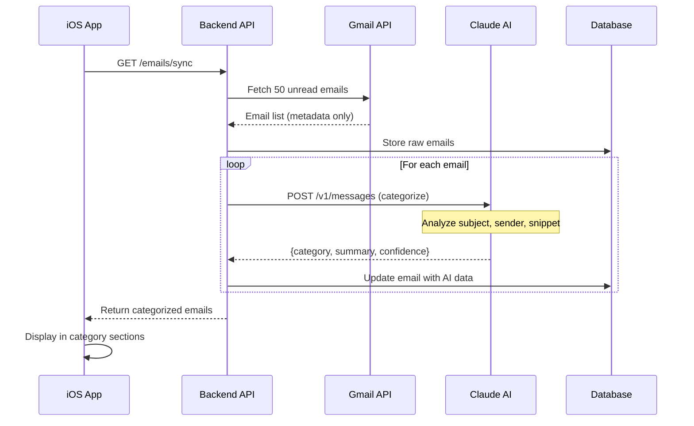
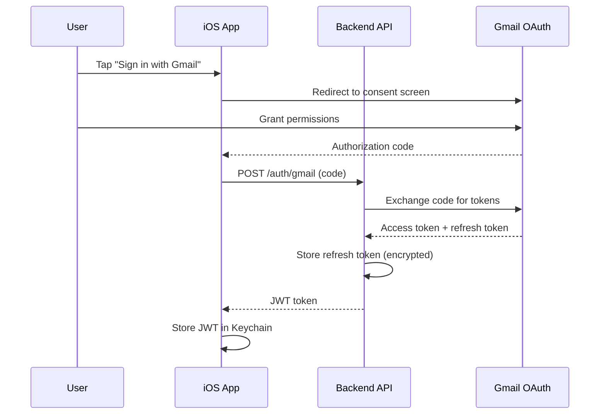

# InboxIQ - Product Requirements Document (PRD)

**Version:** 1.0  
**Date:** February 23, 2026  
**Status:** Ready for Engineering Handoff  
**Timeline:** 8-week MVP to App Store

---

## Table of Contents

1. [Executive Summary](#executive-summary)
2. [Product Vision & Objectives](#product-vision--objectives)
3. [User Stories (MVP - Phase 1)](#user-stories-mvp---phase-1)
4. [Feature Specifications & Acceptance Criteria](#feature-specifications--acceptance-criteria)
5. [MVP vs Future Releases](#mvp-vs-future-releases)
6. [Dependencies & Constraints](#dependencies--constraints)
7. [Success Metrics](#success-metrics)
8. [Technical Architecture](#technical-architecture)
9. [Appendix](#appendix)

---

## 1. Executive Summary

### Problem Statement

Modern professionals are drowning in email. Users juggle 3-5 different email apps and tools because no single application addresses all their pain points:
- **Information overload:** Important emails buried in promotional noise
- **Manual triage:** 30+ minutes daily sorting emails into folders
- **Missed priorities:** Critical emails lost in crowded inboxes
- **Fragmented workflows:** Switching between email, calendar, tasks, and notes

### Solution

InboxIQ is an **AI-powered iPhone email app** that combines intelligent categorization, natural language processing, and elegant design to transform email from overwhelming to manageable. By leveraging Claude AI, InboxIQ automatically organizes, summarizes, and prioritizes emails—saving users 30+ minutes daily.

### Target Users

**Primary:** Knowledge workers, executives, freelancers, and professionals managing 50-200+ emails daily

**Secondary:** Small teams requiring shared inbox collaboration (post-MVP)

### Unique Value Proposition

- **AI-First:** True AI understanding of email content, not just keyword filters
- **Privacy-Focused:** User data stays private; no selling to advertisers
- **Native iOS:** Fluid SwiftUI experience optimized for iPhone
- **Fair Pricing:** Free tier with core features; $9.99/month Pro tier

### MVP Scope (8 Weeks)

Phase 1 delivers core value:
- ✅ Gmail OAuth integration
- ✅ AI categorization with Claude (6 categories)
- ✅ Smart inbox management
- ✅ Search functionality
- ✅ Compose, reply, forward
- ✅ Push notifications
- ✅ iPhone app only (SwiftUI)
- ✅ FastAPI backend

**Go-to-Market:** App Store launch Week 8

---

## 2. Product Vision & Objectives

### Vision Statement

*"Make email intelligent, delightful, and stress-free by combining the best of AI-powered automation with beautiful, native iOS design."*

### Strategic Objectives

#### Q1 2026 (Weeks 1-8): MVP Launch
- Ship to App Store with core AI categorization
- Achieve 100+ TestFlight users
- Validate product-market fit
- Establish baseline metrics (engagement, retention)

#### Q2 2026 (Weeks 9-16): Power User Features
- Multi-account support
- Calendar integration
- Smart compose/reply
- iPad app
- Reach 1,000+ active users

#### Q3 2026 (Weeks 17-24): Team & Monetization
- Shared inbox (team features)
- Pro tier subscription launch
- Mac app
- Target 5,000+ users, 5% conversion

### Product Principles

1. **Speed First:** Sub-100ms interactions; instant app launch
2. **AI-Powered, Not AI-Dependent:** AI enhances, doesn't replace user control
3. **Privacy by Design:** User data encrypted, never sold
4. **Native Excellence:** Embrace iOS design language (SwiftUI, SF Symbols)
5. **Progressive Enhancement:** Free tier provides value; Pro tier delights

### Success Criteria (8-Week MVP)

| Metric | Target | Measurement |
|--------|--------|-------------|
| **App Store Launch** | Week 8 | Binary (shipped or not) |
| **TestFlight Users** | 100+ | App Store Connect analytics |
| **AI Accuracy** | 85%+ | Manual validation of 100 categorizations |
| **Crash-Free Rate** | 99%+ | Firebase Crashlytics |
| **App Store Rating** | 4.0+ | Initial reviews |
| **Daily Active Users** | 50+ | Firebase Analytics |

---

## 3. User Stories (MVP - Phase 1)

### Epic 1: Authentication & Onboarding

**US-001: As a new user, I want to sign in with my Gmail account so that I can access my emails securely**
- **Priority:** P0 (Blocker)
- **Acceptance Criteria:**
  - User taps "Sign in with Gmail"
  - OAuth flow opens in Safari View Controller
  - User grants permissions (read-only access)
  - App receives OAuth token and stores securely in Keychain
  - User redirected to main inbox view
- **Technical Notes:** Use `AppAuth` library for OAuth 2.0 flow; store refresh token encrypted

---

**US-002: As a first-time user, I want a simple onboarding tutorial so that I understand how AI categorization works**
- **Priority:** P1 (Important)
- **Acceptance Criteria:**
  - After first login, show 3-screen carousel explaining categories
  - Screens: (1) AI categorization intro, (2) Category overview, (3) "Refresh to sync"
  - Skip button available on each screen
  - Never shown again after completion
- **Design Notes:** Use iOS native page control dots; system font for accessibility

---

### Epic 2: Email Sync & Display

**US-003: As a user, I want my emails to sync automatically so that I always see the latest messages**
- **Priority:** P0 (Blocker)
- **Acceptance Criteria:**
  - On app launch, fetch unread emails from backend API
  - Display loading indicator during sync
  - Show timestamp of last sync ("Updated 2 min ago")
  - Pull-to-refresh gesture triggers manual sync
  - Background refresh syncs every 15 minutes (when app in background)
- **Technical Notes:** Use `URLSession` with `Background Tasks` framework for background sync

---

**US-004: As a user, I want to see my emails organized by AI categories so that I can quickly identify what needs attention**
- **Priority:** P0 (Blocker)
- **Acceptance Criteria:**
  - Main view shows 6 collapsible categories:
    1. **Urgent** (red badge)
    2. **Action Required** (orange badge)
    3. **FYI** (blue badge)
    4. **Newsletter** (purple badge)
    5. **Receipt** (green badge)
    6. **Spam** (gray badge)
  - Each category shows email count
  - Tap category to expand/collapse email list
  - Emails sorted by date (newest first)
- **Design Notes:** Use iOS list with section headers; SF Symbols for category icons

---

**US-005: As a user, I want to see AI-generated summaries for each email so that I can quickly understand content without opening**
- **Priority:** P1 (Important)
- **Acceptance Criteria:**
  - Each email card displays:
    - Sender name
    - Subject line (bold, 2 lines max)
    - AI summary (gray text, 1 line)
    - Timestamp (relative: "2h ago")
  - Summary limited to 80 characters
  - Truncate with "..." if longer
- **Design Notes:** Use 2-column layout for name/time; summary below subject

---

### Epic 3: Email Reading & Interaction

**US-006: As a user, I want to read full email content so that I can see the complete message**
- **Priority:** P0 (Blocker)
- **Acceptance Criteria:**
  - Tap email card to open detail view
  - Full-screen modal with:
    - Back button (top-left)
    - Sender info (name, email, avatar)
    - Subject line (large title)
    - Timestamp
    - Full email body (formatted HTML)
  - Scroll to read long emails
  - Swipe down to dismiss
- **Technical Notes:** Use `WKWebView` for HTML email rendering; sanitize HTML to prevent XSS

---

**US-007: As a user, I want to archive or delete emails so that I can clean up my inbox**
- **Priority:** P0 (Blocker)
- **Acceptance Criteria:**
  - Swipe left on email card reveals two buttons:
    - 🗑️ Delete (red background)
    - 📦 Archive (blue background)
  - Tap Delete: Email removed from view; Gmail labels updated
  - Tap Archive: Email archived; removed from inbox
  - Undo toast appears for 5 seconds after action
  - Tapping "Undo" restores email to inbox
- **Technical Notes:** Use `UITableView` swipe actions; API call to backend for Gmail updates

---

**US-008: As a user, I want to mark emails as read or unread so that I can track which emails I've processed**
- **Priority:** P1 (Important)
- **Acceptance Criteria:**
  - Swipe right on email card reveals "Mark Read/Unread" button
  - Unread emails show blue dot indicator
  - Read emails have no indicator
  - Marking read/unread updates Gmail via API
  - Change reflected immediately in UI
- **Technical Notes:** Use optimistic UI updates; rollback on API failure

---

### Epic 4: Email Composition

**US-009: As a user, I want to compose new emails so that I can send messages from the app**
- **Priority:** P0 (Blocker)
- **Acceptance Criteria:**
  - Tap "+" button in navigation bar
  - Full-screen compose view with fields:
    - To: (email address input with autocomplete)
    - Subject: (single-line text field)
    - Body: (multi-line text editor)
  - Cancel button (top-left) → confirm discard if changes
  - Send button (top-right) → disabled until To and Subject filled
  - After send: Success toast + close compose view
- **Technical Notes:** Use `UITextView` for body; Gmail API `send` endpoint

---

**US-010: As a user, I want to reply to or forward emails so that I can respond to messages**
- **Priority:** P0 (Blocker)
- **Acceptance Criteria:**
  - In email detail view, show toolbar with buttons:
    - ↩️ Reply
    - ↪️ Reply All
    - ➡️ Forward
  - Tap Reply: Opens compose view pre-filled with:
    - To: Original sender
    - Subject: "Re: [original subject]"
    - Body: Quoted original message
  - Tap Forward: Opens compose view pre-filled with:
    - To: Empty (user fills in)
    - Subject: "Fwd: [original subject]"
    - Body: Original message
- **Technical Notes:** Include email thread ID for proper threading in Gmail

---

### Epic 5: Search & Discovery

**US-011: As a user, I want to search my emails so that I can find specific messages quickly**
- **Priority:** P1 (Important)
- **Acceptance Criteria:**
  - Search bar in navigation bar (tap to activate)
  - Search scope: All emails (across all categories)
  - Search fields: Subject, sender, body content
  - Real-time results as user types (after 3 characters)
  - Results grouped by category
  - Tap result to open email detail view
  - Clear search button (×) resets to inbox
- **Technical Notes:** Use backend API `/search` endpoint; debounce input (300ms)

---

### Epic 6: Notifications

**US-012: As a user, I want push notifications for important emails so that I don't miss urgent messages**
- **Priority:** P1 (Important)
- **Acceptance Criteria:**
  - Request notification permission on first launch
  - Push notifications trigger for:
    - **Urgent** category only (default)
    - Emails from VIP senders (future: user-configurable)
  - Notification displays:
    - Sender name
    - Subject line
    - First 50 chars of AI summary
  - Tap notification opens email detail view
  - Settings screen allows:
    - Enable/disable notifications
    - Choose which categories trigger notifications
- **Technical Notes:** Use Apple Push Notification Service (APNs); backend sends device token to Firebase

---

### Epic 7: Settings & Account Management

**US-013: As a user, I want to log out of my account so that I can switch accounts or protect my privacy**
- **Priority:** P1 (Important)
- **Acceptance Criteria:**
  - Settings screen accessible from tab bar
  - "Log Out" button (red text, bottom of screen)
  - Tap "Log Out" → confirmation alert
  - Confirm → Clear all local data, OAuth tokens, return to login screen
- **Technical Notes:** Clear Keychain, UserDefaults, and cached email data

---

**US-014: As a user, I want to see app version and provide feedback so that I can report issues**
- **Priority:** P2 (Nice-to-Have)
- **Acceptance Criteria:**
  - Settings screen shows:
    - App version (e.g., "Version 1.0 (Build 42)")
    - "Send Feedback" button → Opens email to support@inboxiq.app
    - "Privacy Policy" link → Opens web view
    - "Terms of Service" link → Opens web view
- **Technical Notes:** Use `MFMailComposeViewController` for feedback email

---

## 4. Feature Specifications & Acceptance Criteria

### Feature 1: Gmail OAuth Authentication

**Description:**  
Secure authentication using Gmail OAuth 2.0 to access user's email data.

**Functional Requirements:**
- OAuth 2.0 authorization code flow
- Read-only Gmail scope: `https://www.googleapis.com/auth/gmail.readonly`
- Token storage in iOS Keychain with `kSecAttrAccessibleWhenUnlocked`
- Automatic token refresh when expired (7-day validity)
- Handle OAuth errors (user denial, network failure)

**Non-Functional Requirements:**
- Security: Tokens encrypted at rest
- Performance: OAuth flow completes within 5 seconds
- Reliability: Token refresh succeeds 99% of the time

**Acceptance Criteria:**
1. ✅ User successfully authenticates with Gmail
2. ✅ Refresh token stored securely in Keychain
3. ✅ Expired tokens automatically refreshed
4. ✅ User denied permission → Show error alert with retry option
5. ✅ No tokens stored in UserDefaults or plain text

**Dependencies:**
- Gmail API enabled in Google Cloud Console
- OAuth credentials (Client ID) configured
- `AppAuth-iOS` library integrated

**Edge Cases:**
- User revokes access in Google Account → Show re-authentication prompt
- Network timeout during OAuth → Show retry button
- Multiple Google accounts on device → User selects correct account

---

### Feature 2: AI Email Categorization

**Description:**  
Backend AI engine using Claude Sonnet 4 to categorize emails into 6 smart categories.

**Functional Requirements:**
- Categorize emails into:
  1. **Urgent:** Requires immediate response (<1 hour)
  2. **Action Required:** Needs action but not urgent (today/this week)
  3. **FYI:** Information only, no action needed
  4. **Newsletter:** Subscriptions, marketing emails
  5. **Receipt:** Purchases, transactions, confirmations
  6. **Spam:** Low priority, promotional
- Input to AI: Email subject, sender, first 200 chars of body
- Output from AI: Category name, confidence score, one-sentence summary
- Categorization completes within 3 seconds per email
- Batch process 50 emails in under 2 minutes

**AI Prompt Design:**
```
Analyze this email and categorize it:

Subject: {subject}
From: {sender_email}
Preview: {body_preview}

Categories:
- Urgent: Requires immediate response
- Action Required: Needs action but not urgent
- FYI: Information only
- Newsletter: Subscription/marketing
- Receipt: Transaction confirmation
- Spam: Low priority/promotional

Respond with:
Category: [category_name]
Summary: [one sentence, max 80 chars]
```

**Non-Functional Requirements:**
- Accuracy: 85%+ correct categorization (validated manually)
- Cost: <$0.02 per email (Claude API pricing)
- Latency: <3 seconds per email
- Fallback: If AI fails, default to "FYI" category

**Acceptance Criteria:**
1. ✅ 85%+ emails correctly categorized (manual validation of 100 samples)
2. ✅ AI response parsed successfully 99%+ of the time
3. ✅ Summary limited to 80 characters
4. ✅ If AI API fails, email categorized as "Unknown" with generic summary
5. ✅ Confidence score logged for monitoring (not shown to user in MVP)

**Dependencies:**
- Anthropic API key with Claude Sonnet 4 access
- Backend endpoint: `POST /api/v1/emails/categorize`
- Adequate API rate limits (1,000 requests/hour)

**Edge Cases:**
- Email with no subject → Use first 50 chars of body as subject
- Email in non-English language → AI still categorizes (multilingual support)
- Extremely long email (10K+ words) → Truncate to first 500 words for AI input

---

### Feature 3: Email List View with Categories

**Description:**  
Main inbox view displaying emails grouped by AI category with collapsible sections.

**Functional Requirements:**
- Display 6 category sections (Urgent, Action, FYI, Newsletter, Receipt, Spam)
- Each section header shows:
  - Category icon (SF Symbol)
  - Category name
  - Email count badge
  - Expand/collapse chevron
- Tapping section header toggles expand/collapse
- Expanded section shows list of emails:
  - Sender name (bold)
  - Subject line (2 lines max, truncated)
  - AI summary (gray text, 1 line)
  - Timestamp (relative: "2h ago", "Yesterday", "Jan 15")
  - Unread indicator (blue dot)
- Pull-to-refresh gesture syncs latest emails
- Empty state: "No emails in this category" with icon

**UI/UX Design:**
- Use iOS `List` with `Section` for categories
- SF Symbols:
  - Urgent: `exclamationmark.triangle.fill` (red)
  - Action: `checkmark.circle.fill` (orange)
  - FYI: `info.circle.fill` (blue)
  - Newsletter: `newspaper.fill` (purple)
  - Receipt: `dollarsign.circle.fill` (green)
  - Spam: `trash.fill` (gray)
- Color palette: iOS system colors for accessibility
- Dark mode support

**Non-Functional Requirements:**
- Performance: List scrolls smoothly at 60fps
- Accessibility: VoiceOver support with descriptive labels
- Responsive: Adapts to iPhone SE (small) and iPhone Pro Max (large)

**Acceptance Criteria:**
1. ✅ All 6 categories displayed in order (Urgent → Spam)
2. ✅ Category counts accurate (match backend response)
3. ✅ Tapping category toggles expand/collapse with animation
4. ✅ Email cards show all required info (sender, subject, summary, time)
5. ✅ Pull-to-refresh triggers sync and updates list
6. ✅ Scroll performance: No lag or dropped frames
7. ✅ Dark mode: Colors readable and consistent

**Dependencies:**
- Backend API: `GET /api/v1/emails/categorized`
- SwiftUI `List`, `Section`, `Label` components

**Edge Cases:**
- Zero emails in all categories → Show onboarding prompt "Pull to refresh"
- 100+ emails in one category → Lazy load (show first 50, load more on scroll)
- Very long subject (200+ chars) → Truncate with ellipsis

---

### Feature 4: Email Detail View

**Description:**  
Full-screen view displaying complete email content with formatting preserved.

**Functional Requirements:**
- Display email metadata:
  - Sender name + email address
  - Recipient(s) (To, CC, BCC)
  - Subject line (large title)
  - Timestamp (full date: "Feb 23, 2026 at 2:45 PM")
- Email body:
  - Rendered HTML (preserve formatting, images, links)
  - Sanitized to prevent XSS attacks
  - Scrollable if longer than screen
  - Tap links → Opens Safari in-app browser
  - Tap images → Full-screen image viewer
- Toolbar with actions:
  - ↩️ Reply
  - ↪️ Reply All (if multiple recipients)
  - ➡️ Forward
  - 🗑️ Delete
  - 📦 Archive
- Swipe down or back button to dismiss

**UI/UX Design:**
- Use `NavigationStack` with `NavigationLink`
- WKWebView for HTML rendering
- Toolbar: iOS native `ToolbarItem` with SF Symbols
- Haptic feedback on toolbar button tap

**Non-Functional Requirements:**
- Performance: HTML renders within 500ms
- Security: HTML sanitized (no script execution)
- Accessibility: VoiceOver reads email content

**Acceptance Criteria:**
1. ✅ Email metadata displayed accurately
2. ✅ HTML body renders with formatting preserved
3. ✅ Images load and display correctly
4. ✅ Links tappable and open in Safari View Controller
5. ✅ Toolbar buttons functional (Reply, Forward, Delete, Archive)
6. ✅ Swipe down gesture dismisses view
7. ✅ No crashes on malformed HTML

**Dependencies:**
- Backend API: `GET /api/v1/emails/{email_id}`
- `WKWebView` for HTML rendering
- HTML sanitization library (e.g., SwiftSoup)

**Edge Cases:**
- Email with no body → Show "(No content)"
- Email with huge images (10MB+) → Lazy load, show placeholder
- Email with malicious script tags → Sanitizer removes, logs warning

---

### Feature 5: Email Composition & Send

**Description:**  
Compose new emails, reply to existing emails, and forward messages.

**Functional Requirements:**
- Compose screen fields:
  - **To:** Email address input with autocomplete (contact suggestions)
  - **CC/BCC:** Optional, hidden by default (tap "+" to reveal)
  - **Subject:** Single-line text field
  - **Body:** Multi-line rich text editor
  - **Attachments:** (Future) Not included in MVP
- Validation:
  - To field required (valid email format)
  - Subject optional but warning if empty
  - Body optional
- Actions:
  - **Send:** Validate → API call → Success toast → Close
  - **Cancel:** Prompt "Discard draft?" if changes made
  - **Save Draft:** (Future) Not included in MVP
- Reply/Forward:
  - Pre-fill To, Subject, Body with quoted original message
  - Include original email thread ID for Gmail threading

**UI/UX Design:**
- Full-screen modal with "Cancel" (left) and "Send" (right)
- Send button disabled until validation passes
- Keyboard dismisses on tap outside text field
- Haptic feedback on send success

**Non-Functional Requirements:**
- Performance: Send completes within 3 seconds
- Reliability: Retry failed sends (3 attempts)
- Offline: Show error "No internet connection" if offline

**Acceptance Criteria:**
1. ✅ To field validates email format (RFC 5322)
2. ✅ Send button disabled until To + Subject filled
3. ✅ Tapping Send → API call → Success toast → Close compose
4. ✅ Tapping Cancel → Confirm discard if changes → Close
5. ✅ Reply pre-fills To, Subject ("Re: ..."), Body (quoted)
6. ✅ Forward pre-fills Subject ("Fwd: ..."), Body, To empty
7. ✅ Failed send → Error alert with "Retry" button

**Dependencies:**
- Backend API: `POST /api/v1/emails/send`
- Gmail API: `send` method with thread ID
- Email validation regex or library

**Edge Cases:**
- Invalid email in To field → Show error "Invalid email address"
- Network timeout during send → Show retry option
- Extremely long body (50K+ chars) → Warning "Email may be too large"

---

### Feature 6: Search Functionality

**Description:**  
Search across all emails by subject, sender, or body content.

**Functional Requirements:**
- Search bar in navigation bar (tappable to activate)
- Search activates after user types 3+ characters
- Debounce input: API call triggered 300ms after user stops typing
- Search backend API: `/api/v1/emails/search?q={query}`
- Results display:
  - Grouped by category
  - Highlight matching text (subject/sender)
  - Same card layout as inbox list
  - Tap result → Open email detail view
- Clear button (×) resets to inbox
- Empty state: "No results for '{query}'"

**UI/UX Design:**
- Use iOS `.searchable` modifier on `List`
- Search bar appears in navigation bar
- Results replace inbox view while searching
- Cancel button (top-right) exits search

**Non-Functional Requirements:**
- Performance: Results return within 1 second
- Accuracy: Full-text search across subject, sender, body
- Scalability: Search works with 1,000+ emails

**Acceptance Criteria:**
1. ✅ Search activates after 3 characters typed
2. ✅ Results return within 1 second
3. ✅ Matching text highlighted in subject/sender
4. ✅ Results grouped by category
5. ✅ Tapping result opens email detail view
6. ✅ Clear button resets to inbox
7. ✅ Empty state shows "No results" message

**Dependencies:**
- Backend API: `GET /api/v1/emails/search`
- Backend uses full-text search (PostgreSQL `tsvector` or similar)

**Edge Cases:**
- Query with special characters (e.g., "@", "$") → Escaped properly
- Query returns 100+ results → Lazy load (show first 50)
- Network timeout → Show error "Search unavailable"

---

### Feature 7: Push Notifications

**Description:**  
Push notifications for important emails (Urgent category) to keep users informed.

**Functional Requirements:**
- Request notification permission on first launch
- Backend sends push notifications via Firebase Cloud Messaging (FCM)
- Trigger notifications for:
  - **Urgent** category emails only (MVP default)
  - (Future) User-configurable categories
- Notification payload:
  - Title: Sender name
  - Body: Subject line
  - Subtitle: AI summary (first 50 chars)
  - Custom data: `email_id` (for deep linking)
- Tapping notification opens email detail view
- Settings toggle: Enable/disable notifications

**UI/UX Design:**
- Permission prompt: System default iOS alert
- Settings screen: Toggle switch "Push Notifications"
- Notification center: Standard iOS notification card

**Non-Functional Requirements:**
- Latency: Notifications arrive within 30 seconds of email receipt
- Reliability: 99%+ delivery rate (APNs SLA)
- Frequency: Max 10 notifications/hour (prevent spam)

**Acceptance Criteria:**
1. ✅ Permission requested on first launch
2. ✅ Notifications sent only for Urgent category
3. ✅ Notification displays sender, subject, summary
4. ✅ Tapping notification opens correct email detail view
5. ✅ Settings toggle enables/disables notifications
6. ✅ No duplicate notifications for same email
7. ✅ Notifications respect iOS system settings (Do Not Disturb)

**Dependencies:**
- Apple Push Notification Service (APNs) certificate
- Firebase Cloud Messaging setup
- Backend: Device token registration endpoint `POST /api/v1/devices`
- Backend: Cron job or webhook to monitor new Urgent emails

**Edge Cases:**
- User denies permission → No notifications, show in-app prompt to enable
- Device offline → Notifications queued, delivered when online
- App deleted then reinstalled → Re-register device token

---

## 5. MVP vs Future Releases

### Phase 1: MVP (Weeks 1-8) — App Store Launch

**Core Value Proposition:** AI-powered email categorization and management

| Feature | Description | Priority |
|---------|-------------|----------|
| Gmail OAuth | Secure authentication | P0 |
| AI Categorization | Claude AI sorts emails into 6 categories | P0 |
| Email List View | Collapsible categories with summaries | P0 |
| Email Detail | Read full email with HTML formatting | P0 |
| Compose/Reply/Forward | Send emails, reply to threads | P0 |
| Archive/Delete | Basic email management | P0 |
| Mark Read/Unread | Track processed emails | P1 |
| Search | Find emails by subject, sender, body | P1 |
| Push Notifications | Alerts for Urgent category | P1 |
| Settings | Logout, feedback, privacy policy | P1 |

**Out of Scope (MVP):**
- Multiple email accounts
- Outlook/iCloud support
- Snooze emails
- Send later
- Smart reply (AI-suggested responses)
- Calendar integration
- Attachments
- iPad app
- Mac app
- Shared inbox (team features)

---

### Phase 2: Power User Features (Weeks 9-16)

**Goal:** Delight power users with productivity enhancements

| Feature | Description | User Story |
|---------|-------------|------------|
| Multiple Accounts | Support 3+ Gmail accounts | As a user with work and personal emails, I want to switch between accounts |
| Snooze Emails | Hide email until later | As a user, I want to snooze emails to deal with them later |
| Send Later | Schedule email sending | As a user, I want to schedule emails to send during work hours |
| Smart Compose | AI-powered email writing | As a user, I want AI to draft professional responses |
| Smart Reply | Quick AI-suggested replies | As a user, I want 3 quick reply options |
| Templates | Save common email formats | As a user, I want templates for frequent responses |
| Calendar Integration | Detect meeting invites | As a user, I want calendar invites automatically added |
| VIP Inbox | Priority sender filtering | As a user, I want to see only VIP emails |
| iPad Support | Optimized for iPad | As a user with an iPad, I want a tablet-optimized experience |

**Timeline:** 8 weeks (2 sprints x 4 weeks)

---

### Phase 3: Team Collaboration (Weeks 17-24)

**Goal:** Enable team-based email management

| Feature | Description | User Story |
|---------|-------------|------------|
| Shared Inbox | Multiple users manage one inbox | As a team, we want to collaborate on support@ emails |
| Email Assignment | Assign emails to teammates | As a manager, I want to delegate emails to my team |
| Internal Notes | Comment without sending | As a team member, I want to add context for colleagues |
| SLA Tracking | Monitor response times | As a support lead, I want to track SLA compliance |
| Team Templates | Shared response templates | As a team, we want consistent messaging |
| Analytics Dashboard | Email metrics (volume, response time) | As a manager, I want to see team performance |
| Mac App | Desktop experience | As a desktop user, I want a Mac app |

**Timeline:** 8 weeks (2 sprints x 4 weeks)

---

### Phase 4: Advanced AI (Weeks 25-32)

**Goal:** Leverage AI for proactive assistance

| Feature | Description | User Story |
|---------|-------------|------------|
| Meeting Prep | AI summarizes emails before meetings | As a user, I want context before meetings |
| Email Bundles | Group related emails | As a user, I want newsletters bundled together |
| Sender Insights | Relationship analytics | As a user, I want to see response patterns |
| Smart Scheduling | AI suggests meeting times | As a user, I want AI to find meeting times |
| Tone Adjustment | Rewrite email in different tone | As a user, I want to adjust email formality |
| Translation | Auto-translate emails | As a user, I want to read foreign language emails |
| Action Extraction | Extract tasks from emails | As a user, I want to see actionable items |

**Timeline:** 8 weeks (2 sprints x 4 weeks)

---

### Phase 5: Ecosystem & Integrations (Weeks 33-40)

**Goal:** Connect InboxIQ to user's productivity stack

| Feature | Description | User Story |
|---------|-------------|------------|
| Zapier Integration | Connect to 5,000+ apps | As a power user, I want to automate workflows |
| CRM Sync | Salesforce, HubSpot integration | As a sales rep, I want emails logged to CRM |
| Task Apps | Todoist, Asana, Linear sync | As a user, I want emails converted to tasks |
| Cloud Storage | Dropbox, Google Drive for attachments | As a user, I want to save attachments to cloud |
| Note Apps | Evernote, Notion integration | As a user, I want to save emails as notes |
| Slack | Post email summaries to Slack | As a team, we want email updates in Slack |
| Web App | Browser access | As a user, I want to access emails on any device |
| Apple Watch | Quick triage on wrist | As an Apple Watch user, I want to triage emails |

**Timeline:** 8 weeks (2 sprints x 4 weeks)

---

### Long-Term Vision (12+ Months)

**Future Innovations:**
- **AI Email Agent:** Fully autonomous email assistant (draft, send, schedule)
- **Voice Control:** Siri integration ("Check my urgent emails")
- **AR Email Management:** Vision Pro spatial computing interface
- **Blockchain Verified Email:** Prevent spoofing with cryptographic signatures
- **Multi-Channel Inbox:** Slack, SMS, social DMs in one app

---

## 6. Dependencies & Constraints

### Technical Dependencies

#### External Services

| Service | Purpose | SLA | Cost (MVP) | Risk |
|---------|---------|-----|------------|------|
| **Gmail API** | Email access | 99.9% | Free (1B requests/day) | Low: Stable API |
| **Anthropic Claude** | AI categorization | 99.5% | $20-40/month (1K emails/day) | Medium: API costs scale with usage |
| **Apple APNs** | Push notifications | 99.9% | Free | Low: Built into iOS |
| **Firebase** | Analytics, Crashlytics | 99.95% | Free tier | Low: Google-backed |
| **FastAPI Backend** | REST API server | Custom | $10-20/month (Railway) | Medium: Self-hosted reliability |

#### Internal Systems

| Component | Technology | Owner | Risk |
|-----------|------------|-------|------|
| **iOS App** | SwiftUI, Swift 5.9+ | iOS Dev Team | Low |
| **Backend API** | FastAPI, Python 3.11+ | Backend Dev Team | Medium |
| **Database** | PostgreSQL 15+ | Backend Dev Team | Low |
| **Email Storage** | S3-compatible (Cloudflare R2) | DevOps | Low |

---

### Constraints

#### Timeline Constraints

**8-Week MVP Deadline (Hard Constraint):**
- Week 8: App Store submission
- Week 7: TestFlight beta testing
- Week 6: Feature freeze
- Weeks 1-5: Development sprints

**Critical Path:**
1. Gmail OAuth (Week 1) → Blocks all email features
2. Backend API (Weeks 1-2) → Blocks frontend data fetching
3. AI Categorization (Week 2) → Core value proposition
4. Email List UI (Week 3) → User-facing interface

**Slack Mitigation:**
- 20% time buffer built into each sprint
- P2 features cut if timeline at risk
- Daily standups to identify blockers early

---

#### Resource Constraints

**Team Composition:**
- 1 iOS Developer (full-time)
- 1 Backend Developer (full-time)
- 1 Designer (part-time, 50%)
- 1 Product Manager (part-time, 50%)

**Budget:**
- Development: $0 (internal team)
- External services: $100/month (AI, hosting)
- Apple Developer Program: $99/year
- Total MVP cost: ~$500 for 8 weeks

**Infrastructure:**
- Single backend server (Railway Hobby plan: $5/month)
- PostgreSQL database (Railway add-on: $10/month)
- No CDN required (MVP)

---

#### Technical Constraints

**Platform:**
- iOS 17+ only (no legacy support)
- iPhone only (iPad/Mac out of scope)
- SwiftUI exclusively (no UIKit)

**API Limits:**
| Service | Limit | MVP Impact |
|---------|-------|------------|
| Gmail API | 250 requests/second/user | Low: Users fetch <10 req/min |
| Claude API | 1,000 requests/hour | Medium: 1K emails/hour max |
| APNs | 5,000 notifications/second | Low: Users receive <10/day |

**Performance Targets:**
- App launch: <1 second (cold start)
- Email sync: <5 seconds (50 emails)
- AI categorization: <3 seconds per email
- Search: <1 second (1,000 emails)

---

#### Privacy & Security Constraints

**Data Handling:**
- OAuth tokens: Stored in iOS Keychain (encrypted)
- Email content: Cached locally (encrypted via iOS Data Protection)
- User data: Not sold to third parties (privacy policy)
- AI processing: Email metadata only (subject, sender, snippet)

**Compliance:**
- GDPR: Right to delete (future: export user data)
- CCPA: Privacy policy discloses data usage
- Apple App Store Guidelines: 2.5.13 (access to protected data)

**Security Practices:**
- HTTPS for all API calls (TLS 1.3+)
- API keys: Stored in backend environment variables
- HTML sanitization: Prevent XSS in email bodies
- Rate limiting: Prevent abuse (10 requests/minute/user)

---

#### Business Constraints

**Freemium Model:**
- Free tier: 1 account, basic AI (500 actions/month)
- Pro tier: Unlimited accounts, advanced AI (future: $9.99/month)
- No paywall in MVP (monetization Phase 2)

**App Store Requirements:**
- Privacy nutrition labels: Disclose data collection
- Screenshot requirements: 3 iPhone screenshots
- App description: <4,000 characters
- Age rating: 4+ (no mature content)

---

### Risk Assessment

| Risk | Probability | Impact | Mitigation |
|------|-------------|--------|------------|
| **Gmail API quota exceeded** | Low | High | Implement caching; request quota increase |
| **Claude API downtime** | Medium | High | Fallback to local categorization (keyword-based) |
| **iOS 18 breaking changes** | Low | Medium | Lock to iOS 17 SDK; test on iOS 18 beta |
| **App Store rejection** | Low | High | Follow guidelines strictly; pre-submission review |
| **Backend server crash** | Medium | High | Auto-restart (Railway); uptime monitoring (UptimeRobot) |
| **Timeline slippage** | Medium | Medium | Cut P2 features; prioritize P0/P1 only |

---

## 7. Success Metrics

### North Star Metric

**"Daily Active Users (DAU) who process 10+ emails per day"**

*Rationale:* Users who actively engage with the app daily (processing emails) demonstrate product-market fit and habit formation.

---

### Key Performance Indicators (KPIs)

#### Product Metrics (8-Week MVP)

| Metric | Target | Measurement Method | Review Cadence |
|--------|--------|-------------------|----------------|
| **App Store Launch** | Week 8 | Binary (shipped/not shipped) | End of Week 8 |
| **TestFlight Installs** | 100+ | App Store Connect | Weekly |
| **Daily Active Users (DAU)** | 50+ | Firebase Analytics | Daily |
| **User Retention (Day 7)** | 40%+ | Firebase Analytics | Weekly |
| **Crash-Free Rate** | 99%+ | Firebase Crashlytics | Daily |
| **AI Categorization Accuracy** | 85%+ | Manual validation (100 samples) | Bi-weekly |
| **Avg Session Duration** | 5+ minutes | Firebase Analytics | Weekly |
| **App Store Rating** | 4.0+ stars | App Store Connect | Weekly |

---

#### User Engagement Metrics

**Email Processing:**
| Metric | Target | Measurement |
|--------|--------|-------------|
| Emails viewed per session | 15+ | Firebase event: `email_viewed` |
| Emails archived/deleted per session | 5+ | Firebase event: `email_archived`, `email_deleted` |
| Searches per week | 2+ | Firebase event: `search_performed` |
| Compose actions per week | 3+ | Firebase event: `email_sent` |

**Feature Adoption:**
| Feature | Target Adoption | Measurement |
|---------|----------------|-------------|
| Pull-to-refresh | 80% of users | Firebase event: `sync_triggered` |
| Search | 60% of users | Firebase event: `search_used` |
| Compose/Reply | 70% of users | Firebase event: `email_sent` |
| Push Notifications | 50% enabled | Firebase: Notification permission rate |

---

#### Technical Performance Metrics

| Metric | Target | Measurement | Alerting |
|--------|--------|-------------|----------|
| **API Response Time (p95)** | <2 seconds | Backend logs | Slack alert if >3s |
| **App Launch Time (cold)** | <1 second | Xcode Instruments | Weekly review |
| **Email Sync Time (50 emails)** | <5 seconds | Backend logs | Slack alert if >10s |
| **AI Categorization Latency** | <3 seconds | Backend logs | Slack alert if >5s |
| **Backend Uptime** | 99.5%+ | UptimeRobot | Slack alert on downtime |
| **Error Rate** | <1% | Backend error logs | Slack alert if >2% |

---

#### Business Metrics (Post-MVP)

| Metric | Target | Measurement | Timeline |
|--------|--------|-------------|----------|
| **Free → Pro Conversion** | 5-8% | Stripe analytics | Phase 2 (Week 12) |
| **Monthly Recurring Revenue (MRR)** | $5,000 | Stripe dashboard | Phase 2 (Week 16) |
| **Customer Lifetime Value (LTV)** | $200+ | Cohort analysis | Phase 3 (Week 24) |
| **Churn Rate** | <5%/month | Stripe analytics | Phase 2 (Week 12) |

---

### Success Criteria by Phase

#### Phase 1 (MVP — Week 8)

**✅ Shipped:**
- App live on App Store
- All P0/P1 features functional
- Zero critical bugs

**✅ Adoption:**
- 100+ TestFlight users
- 50+ DAU
- 40%+ Day 7 retention

**✅ Quality:**
- 99%+ crash-free rate
- 4.0+ App Store rating (initial reviews)
- 85%+ AI accuracy

**Exit Criteria:** Product is stable, users engaged, ready for Phase 2 features

---

#### Phase 2 (Weeks 9-16)

**Targets:**
- 500+ DAU
- 5% conversion to Pro tier (if launched)
- 60%+ Day 30 retention
- 4.5+ App Store rating

---

#### Phase 3 (Weeks 17-24)

**Targets:**
- 2,000+ DAU
- $5,000 MRR
- 10+ team customers
- 4.6+ App Store rating

---

### Monitoring & Reporting

**Daily:**
- DAU, crash-free rate, backend uptime
- Slack alerts for critical issues

**Weekly:**
- User retention cohorts
- Feature adoption rates
- App Store reviews

**Monthly:**
- Product review meeting (team retrospective)
- User feedback analysis (support tickets, reviews)
- Roadmap adjustments based on data

**Tools:**
- Firebase Analytics (user behavior)
- Firebase Crashlytics (crash reports)
- App Store Connect (downloads, ratings)
- Backend logs (API performance)
- UptimeRobot (backend uptime)

---

## 8. Technical Architecture

### System Overview

**Architecture Pattern:** Client-Server (iOS App + Backend API)

```
┌─────────────────────────────────────────────────┐
│                iOS App (SwiftUI)                │
│  - Gmail OAuth flow                             │
│  - Email list view                              │
│  - Compose/reply/forward                        │
│  - Push notifications                           │
└──────────────────┬──────────────────────────────┘
                   │ HTTPS (REST API)
                   │
┌──────────────────▼──────────────────────────────┐
│           Backend API (FastAPI)                 │
│  - User authentication                          │
│  - Gmail API integration                        │
│  - Email fetching & storage                     │
│  - AI categorization orchestration              │
│  - Push notification delivery                   │
└──────────────────┬──────────────────────────────┘
                   │
        ┌──────────┴──────────┬──────────────────┐
        │                     │                  │
┌───────▼───────┐   ┌─────────▼────────┐   ┌────▼────────┐
│  Gmail API    │   │  Anthropic Claude│   │ PostgreSQL  │
│  (OAuth 2.0)  │   │  (AI Categorize) │   │ (Database)  │
└───────────────┘   └──────────────────┘   └─────────────┘
```

---

### Technology Stack

#### iOS App (Frontend)

| Component | Technology | Version | Purpose |
|-----------|------------|---------|---------|
| **Language** | Swift | 5.9+ | iOS development |
| **UI Framework** | SwiftUI | iOS 17+ | Declarative UI |
| **HTTP Client** | URLSession | Built-in | API calls |
| **OAuth Library** | AppAuth-iOS | 1.6+ | Gmail OAuth |
| **Notifications** | UserNotifications | Built-in | Push notifications |
| **Analytics** | Firebase SDK | 10.20+ | Crashlytics, Analytics |
| **Keychain** | Security.framework | Built-in | Token storage |

**Key Libraries:**
```swift
// Package.swift dependencies
dependencies: [
  .package(url: "https://github.com/openid/AppAuth-iOS.git", from: "1.6.0"),
  .package(url: "https://github.com/firebase/firebase-ios-sdk.git", from: "10.20.0")
]
```

---

#### Backend API

| Component | Technology | Version | Purpose |
|-----------|------------|---------|---------|
| **Language** | Python | 3.11+ | Backend logic |
| **Framework** | FastAPI | 0.109+ | REST API |
| **Database** | PostgreSQL | 15+ | Data persistence |
| **ORM** | SQLAlchemy | 2.0+ | Database queries |
| **HTTP Client** | httpx | 0.26+ | External API calls |
| **Task Queue** | Celery + Redis | 5.3+ | Background jobs |
| **Hosting** | Railway | - | Cloud hosting |

**Key Dependencies:**
```python
# requirements.txt
fastapi==0.109.0
uvicorn==0.27.0
sqlalchemy==2.0.25
psycopg2-binary==2.9.9
anthropic==0.18.1
google-auth==2.27.0
google-api-python-client==2.116.0
celery==5.3.6
redis==5.0.1
pydantic==2.6.0
python-jose==3.3.0
```

---

### API Endpoints

**Base URL:** `https://api.inboxiq.app/v1` (Production)  
**Dev URL:** `http://localhost:8000/v1` (Local)

#### Authentication

```
POST /auth/gmail
Request Body: { "code": "oauth_authorization_code" }
Response: { "access_token": "jwt_token", "refresh_token": "...", "expires_in": 3600 }
```

#### Email Fetching

```
GET /emails/sync
Headers: { "Authorization": "Bearer {jwt_token}" }
Query Params: { "limit": 50 }
Response: { "emails": [ { "id": "...", "subject": "...", ... } ], "count": 50 }
```

#### AI Categorization

```
POST /emails/categorize
Headers: { "Authorization": "Bearer {jwt_token}" }
Request Body: { "email_ids": ["id1", "id2"] }
Response: { "categorized": [ { "id": "id1", "category": "Urgent", "summary": "..." } ] }
```

#### Email Actions

```
DELETE /emails/{email_id}
POST /emails/{email_id}/archive
PATCH /emails/{email_id}/read
```

#### Search

```
GET /emails/search?q={query}
Response: { "results": [ { "id": "...", "subject": "...", ... } ], "count": 10 }
```

#### Compose/Send

```
POST /emails/send
Request Body: { "to": "user@example.com", "subject": "...", "body": "...", "thread_id": "..." }
Response: { "id": "...", "status": "sent" }
```

---

### Data Models

#### User

```python
class User(Base):
    __tablename__ = "users"
    
    id = Column(UUID, primary_key=True)
    email = Column(String, unique=True, nullable=False)
    gmail_refresh_token = Column(String, encrypted=True)
    created_at = Column(DateTime, default=datetime.utcnow)
    last_sync_at = Column(DateTime, nullable=True)
    
    # Relationships
    emails = relationship("Email", back_populates="user")
    devices = relationship("Device", back_populates="user")
```

#### Email

```python
class Email(Base):
    __tablename__ = "emails"
    
    id = Column(String, primary_key=True)  # Gmail message ID
    user_id = Column(UUID, ForeignKey("users.id"))
    thread_id = Column(String)
    subject = Column(Text)
    sender_name = Column(String)
    sender_email = Column(String)
    recipient_emails = Column(ARRAY(String))
    body_plain = Column(Text)
    body_html = Column(Text)
    snippet = Column(String(200))
    received_at = Column(DateTime)
    is_read = Column(Boolean, default=False)
    is_archived = Column(Boolean, default=False)
    
    # AI fields
    category = Column(String)  # Urgent, Action, FYI, Newsletter, Receipt, Spam
    ai_summary = Column(String)
    confidence_score = Column(Float)
    
    created_at = Column(DateTime, default=datetime.utcnow)
    
    # Relationships
    user = relationship("User", back_populates="emails")
```

#### Device (for push notifications)

```python
class Device(Base):
    __tablename__ = "devices"
    
    id = Column(UUID, primary_key=True)
    user_id = Column(UUID, ForeignKey("users.id"))
    device_token = Column(String, unique=True)
    platform = Column(String)  # "ios"
    created_at = Column(DateTime, default=datetime.utcnow)
    
    user = relationship("User", back_populates="devices")
```

---

### AI Categorization Flow



---

### Security Architecture

**Authentication Flow:**



**Token Storage:**
- iOS: JWT stored in Keychain (`kSecAttrAccessibleWhenUnlocked`)
- Backend: Gmail refresh token encrypted in PostgreSQL (AES-256)

**API Security:**
- All endpoints require JWT bearer token (except `/auth/*`)
- JWTs expire after 7 days (user must re-authenticate)
- Rate limiting: 10 requests/minute per user (IP-based)

---

### Scalability Plan

**MVP (0-1K users):**
- Single Railway instance (512MB RAM, 1 CPU)
- PostgreSQL (shared instance, 1GB storage)
- No caching (direct API calls)

**Growth (1K-10K users):**
- Horizontal scaling: 2-3 Railway instances (load balanced)
- Redis cache (email metadata, 1-hour TTL)
- PostgreSQL upgrade (dedicated instance, 10GB)
- CDN for static assets (Cloudflare)

**Scale (10K+ users):**
- Kubernetes cluster (auto-scaling)
- PostgreSQL replica (read-only queries)
- Celery workers for background jobs (email sync, AI categorization)
- ElasticSearch for full-text search

---

### Performance Optimizations

**iOS App:**
- Lazy loading email lists (paginate 50 at a time)
- Image caching (Kingfisher library)
- Background fetch (sync every 15 minutes)
- SwiftUI `LazyVStack` for efficient rendering

**Backend API:**
- Database indexing (`user_id`, `category`, `received_at`)
- Connection pooling (SQLAlchemy)
- Batch AI categorization (5 emails at a time)
- Gzip compression for API responses

**AI Cost Optimization:**
- Cache categorization for newsletters (same sender → same category)
- Use Claude Haiku for receipts/spam (cheaper, simpler)
- Batch API calls (reduce HTTP overhead)

---

## 9. Appendix

### A. Glossary

| Term | Definition |
|------|------------|
| **AI Categorization** | Automatic sorting of emails into predefined categories using AI (Claude) |
| **OAuth 2.0** | Open standard for authorization (used for Gmail access) |
| **JWT** | JSON Web Token (secure user authentication) |
| **APNs** | Apple Push Notification Service (iOS push notifications) |
| **Snooze** | Hide email temporarily until specified time |
| **VIP** | Very Important Person (priority sender filtering) |
| **Thread** | Email conversation (original + replies) |
| **Snippet** | Short preview of email body (first 150 characters) |

---

### B. References

**Technical Documentation:**
- Gmail API: https://developers.google.com/gmail/api
- Anthropic Claude API: https://docs.anthropic.com/claude/reference
- SwiftUI: https://developer.apple.com/documentation/swiftui
- FastAPI: https://fastapi.tiangolo.com

**Design Resources:**
- Apple Human Interface Guidelines: https://developer.apple.com/design/human-interface-guidelines
- SF Symbols: https://developer.apple.com/sf-symbols

**Competitive Analysis:**
- Superhuman: https://superhuman.com
- Hey: https://hey.com
- Spark: https://sparkmailapp.com

---

### C. User Persona

**Primary Persona: "Busy Professional Priya"**

- **Age:** 32
- **Role:** Marketing Manager at tech startup
- **Email Volume:** 150-200 emails/day
- **Pain Points:**
  - Drowning in promotional emails
  - Misses urgent client requests buried in inbox
  - Spends 60+ minutes daily on email
  - Uses 3 apps: Gmail (web), Slack, Calendar
- **Goals:**
  - Respond to urgent emails within 1 hour
  - Reduce email triage time to 15 minutes/day
  - Never miss important client messages
  - Work-life balance (no email after 7 PM)
- **Tech Savvy:** High (early adopter, uses productivity tools)
- **Willingness to Pay:** $10-15/month for time savings

---

### D. Open Questions (To Resolve)

| Question | Owner | Deadline |
|----------|-------|----------|
| Should free tier include AI categorization? | Product | Week 1 |
| How many categories should users customize? | Product | Week 2 |
| Offline mode: Full or read-only? | Engineering | Week 3 |
| Push notifications: All categories or Urgent only? | Product | Week 1 |
| Multi-account: Support in MVP or Phase 2? | Product | Week 1 |

---

### E. Change Log

| Date | Version | Changes | Author |
|------|---------|---------|--------|
| 2026-02-23 | 1.0 | Initial PRD creation | Shiv 🔥 |

---

## Approval Signatures

| Role | Name | Signature | Date |
|------|------|-----------|------|
| **Product Manager** | [Name] | __________ | ______ |
| **Engineering Lead** | [Name] | __________ | ______ |
| **Design Lead** | [Name] | __________ | ______ |
| **Executive Sponsor** | [Name] | __________ | ______ |

---

**End of Document**

*This PRD is a living document. Updates will be versioned and tracked in Git.*

---

**Contact:**
- Product Manager: [pm@inboxiq.app](mailto:pm@inboxiq.app)
- Engineering Questions: [eng@inboxiq.app](mailto:eng@inboxiq.app)
- Slack Channel: #inboxiq-mvp
